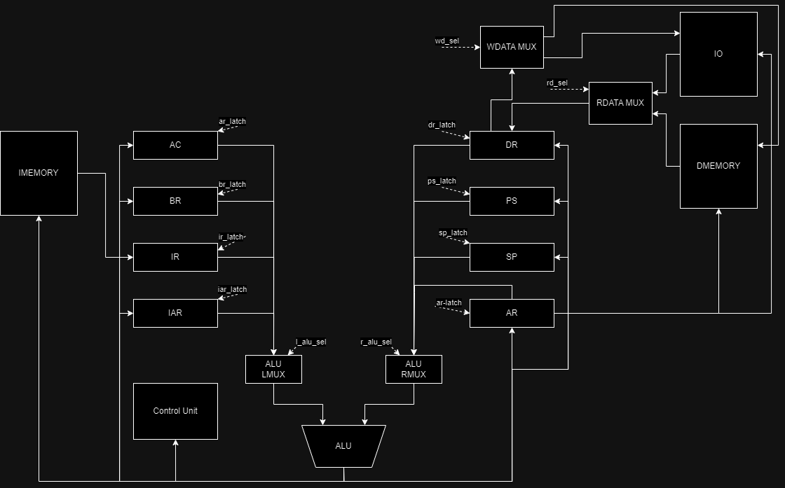

# Ivan Voronin P33312 

## lisp | acc | harv | mc | tick | struct | stream | port | cstr | prob5 | 8bit

## How to

Комплияция кода
```
python -m compiler <input.lsp> <output.yaml> <input>
```

## Lisp syntax

```lisp
<program>               := <expressions> EOF

<expression>            ::= <expression> | <literal> | <varname>

<expressions>           ::= <expression> | <expression> <expressions>

<multi-expression>      ::= "(" <expressions> ")"

<load-ptr>              ::= "(" "&" <varname> ")"

<function-definition>   ::= "(" defun <varname> <open-bracket> <expression> ")"

<func-call-expression>  ::= "(" call <varname> <expressions> ")"

<func-ret-expression>   ::= "(" ret <varname> ")"

<assignment>            ::= "(" let <varname> <expression> ")"

<allocation>            ::= "(" alloc <varname> <expression> ")"

<if-condition>          ::= "(" if <condition-expression> <true-expression> ")"

<loop-expression>       ::= "(" while <condition-expression> do <expressions> ")"

<math-operator>         ::= "<" | ">=" | "!=" | "=" | "<<" | ">>" | "+" | "-" 

<memory-operator>       ::= "(" save | load | offset <varname> <expression> ")"

<io-operator>           ::= "(" read | write <varname> <expression> ")"

<if-expression>         ::= <open-bracket> "if <open-bracket> 

<literal>               ::= <number-literal> | <string-literal> 

<number-literal>        ::= [0-9]+

<string-literal>        ::= "\w*"

<varname>               ::= [a-zA-Z\.]\w*

<include>               ::= "#include " .+ <EOL>
```

## Memory layout

Использутется гарвардская архитектура, поэтому память инструкций и память данных разделена.
Память представляет из себя линейное адресное пространство, состоящее из 32-битных слов.

```
   Instruction memory
+------------------------------+
| 00  : Instruction            |
|    ...                       |
| 10  : Instruction            |
| 11  : Instruction            |
|    ...                       |
| n   : program start          |
|    ...                       |
| i   : Instruction            |
| i+1 : Instruction            |
|    ...                       |
+------------------------------+
```

```
          Data memory
+------------------------------+
| 00         : variable 1      |
| 01         : variable 2      |
|    ...                       |
| s+0        : variable 3      |
| s+1        : variable 3      |
|    ...                       |
| s+len(str) : variable 3      |
|    ...                       |
+------------------------------+
```

Все переменные имеют глобальную область видимости.

## Instruction set

* Машинное слово - 32 бит, знаковое
* Доступ к памяти данных осуществляется по адресу, который указан в инструкции
* Ввод/вывод осуществляется путем чтения и записи в устройство по номеру порта
* Адресация абсолютная, адрес хранится в инструкции в виде операнда

| Byte | Description   |
|------|---------------|
| 0    | Operand       |
| 1    | Operand       |
| 2    | Operand       |
| 3    | Operand       |
| 4    | Operand         (Only 1 lower bit)  |
| 5    |               |
| 6    | OpCode        |
| 7    | OpCode        |

| Opcode | Instruction | Operand | Description |
|--------|-------------|---------|-------------|
| 0x0    | NOP         |         |  Nothing    |
| 0x1    | LD          |   ADDR  |  MEM[ADDR] -> AC|
| 0x2    | HLT         |         |  Stop clk|
| 0x3    | PUSH        |         |  AC -> SP+1|
| 0x4    | POP         |         |  SP -> AC, SP-1|
| 0x5    | ST          |   ADDR  |  AC -> MEM[ADDR] |
| 0x6    | JMP         |   ADDR  |  ADDR -> IAR |
| 0x7    | ROL         |         |  AC << 1|
| 0x8    | ROR         |         |  AC >> 1|
| 0x9    | ADD         |   ADDR  |  AC + MEM[ADDR]|
| 0xA    | SUB         |   ADDR  |  AC - MEM[ADDR]|
| 0xB    | JZ          |         |  IF FLAG.Z, IAR+1|
| 0xC    | JN          |         |  IF FLAG.N, IAR+1|
| 0xD    | JC          |         |  IF FLAG.C, IAR+1|
| 0xE    | LDBF        |   PORT  |  IO[PORT] -> AC |
| 0xF    | STBF        |   PORT  |  AC -> IO[PORT] |
| 0x10   | CALL        |   ADDR  |  IAR -> SP, ADDR -> IAR |
| 0x11   | LDI         |         |  MEM[AR] -> AC |
| 0x12   | BSTI        |         |  BR -> DR, DR -> MEM[AR] |
| 0x13   | STBR        |         |  AC -> BR |
| 0x14   | AND         |   ADDR  |   AC & MEM[ADDR] |
| 0x20   | RET         |         |  SP -> IAR |
| 0x21   | JNN         |         |  IF NOT FLAG.N, IAR+1 |
| 0x22   | JNZ         |         |  IF NOT FLAG.Z, IAR+1  |
| 0x30   | LDC         |  CONST  |  CONST -> AC |
| 0x40   | LDAC        |         |  AC -> AR, MEM[AR] -> AC |
| 0x80   | STAC        |         |  AC -> AR |


### Кодирование инструкций
Машинный код сериализуется в список YAML

Пример:

```yaml
data:
  a:
    addr: 0
    value: 52
  b:
    addr: 1
    value: 0
  c:
    addr: 2
    value: rndmstr
input: String
instructions:
- addr: '0x0'
  instruction: LDC
  op: 0
- addr: '0x1'
  instruction: ST
  op: 0
start_addr: 415
```
## Microcode 

Микрокоманда - 32 бита 

Микрокоманды хранятся в памяти микрокоманд 

Разделены на операционные и управляющие. Операционные - для чтения/записи регистров и памяти, управляющие - для условных переходов.

Форматы команд: 

**Операционная микрокоманда**

```
|Bit | Description |
|----|-------------|
| 0  | DR -> RALU  |
| 1  | SP -> RALU  |
| 2  | PS -> RALU  |
| 3  |             |
| 4  | AC -> LALU  |
| 5  | BR -> LALU  |
| 6  | IAR -> LALU |
| 7  | IR -> LALU  |
| 8  | ~RALU       |
| 9  | ~LALU       |
| 10 | L + R       |
| 11 | AND         |
| 12 | SHLT        |
| 13 | SHRT        |
| 14 | INC         |
| 15 | 2LB         |
| 16 | ALU -> DR   |
| 17 | ALU -> SP   |
| 18 | ALU -> PS   |
| 19 | ALU -> AR   |
| 20 | ALU -> AC   |
| 21 | ALU -> BR   |
| 22 | ALU -> IAR  |
| 23 | MEM -> DR   |
| 24 | DR -> MEM   |
| 25 | IO -> DR    |
| 26 | DR -> IO    |
| 27 |             |
| 28 |             |
| 29 |             |
| 30 | HALT        |
| 31 | 0           |
```

**Управляющая микрокоманда**

```
|Bit | Description |
|----|-------------|
| 0  | DR -> RALU  |
| 1  | SP -> RALU  |
| 2  | PS -> RALU  |
| 3  |             |
| 4  | AC -> LALU  |
| 5  | BR -> LALU  |
| 6  | IAR -> LALU |
| 7  | IR -> LALU  |
| 8  | ~RALU       |
| 9  | ~LALU       |
| 10 | L + R       |
| 11 | AND         |
| 12 | SHLT        |
| 13 | SHRT        |
| 14 | INC         |
| 15 | 2LB         |
| 16 | CMP Z       |
| 17 | CMP N       |
| 18 | CMP C       |
| 19 | CMP V       |
| 20 | CMP NOT Z   |
| 21 | CMP NOT N   |
| 22 |             |
| 23 |             |
| 24 |             |
| 25 |             |
| 26 |             |
| 27 |             |
| 28 |             |
| 29 |             |
| 30 |             |
| 31 | 1           |
```


## Data Path



## Control Unit


## Статистика по задачам

```
| ФИО          | алг             | LoC | code байт | code инстр. | инстр. | такт.  |
| Воронин Иван | hello           | 3   | -         | 418         | 285    | 859    |
| Воронин Иван | cat             | 3   | -         | 421         | 727    | 2193   |
| Воронин Иван | hello_user_name | 9   | -         | 430         | 885    | 2691   |
```
